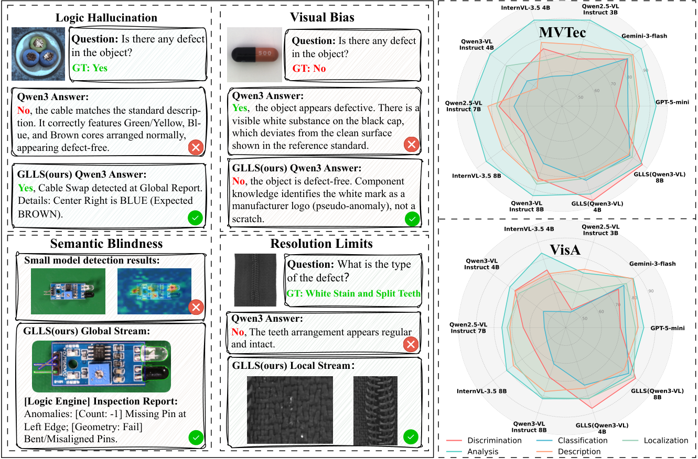
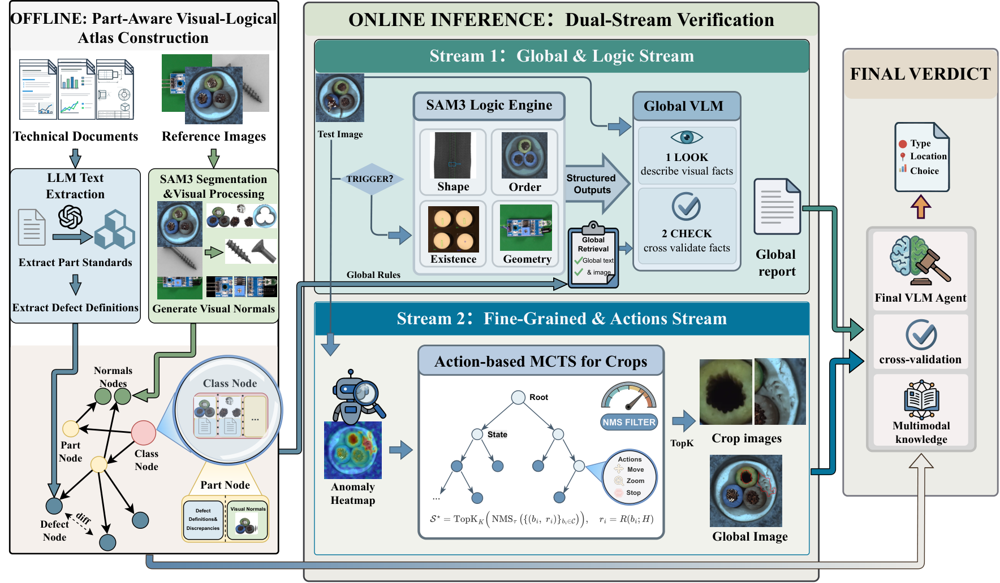
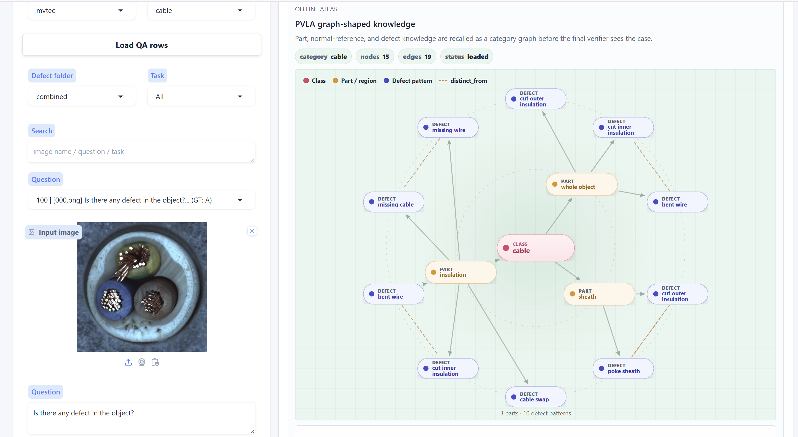
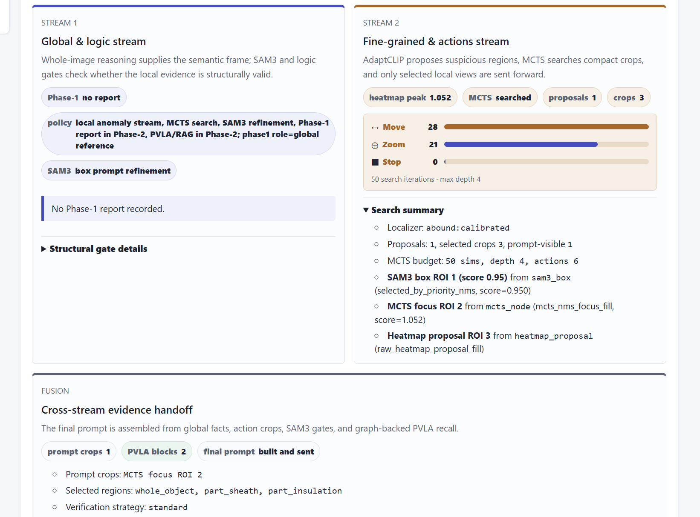
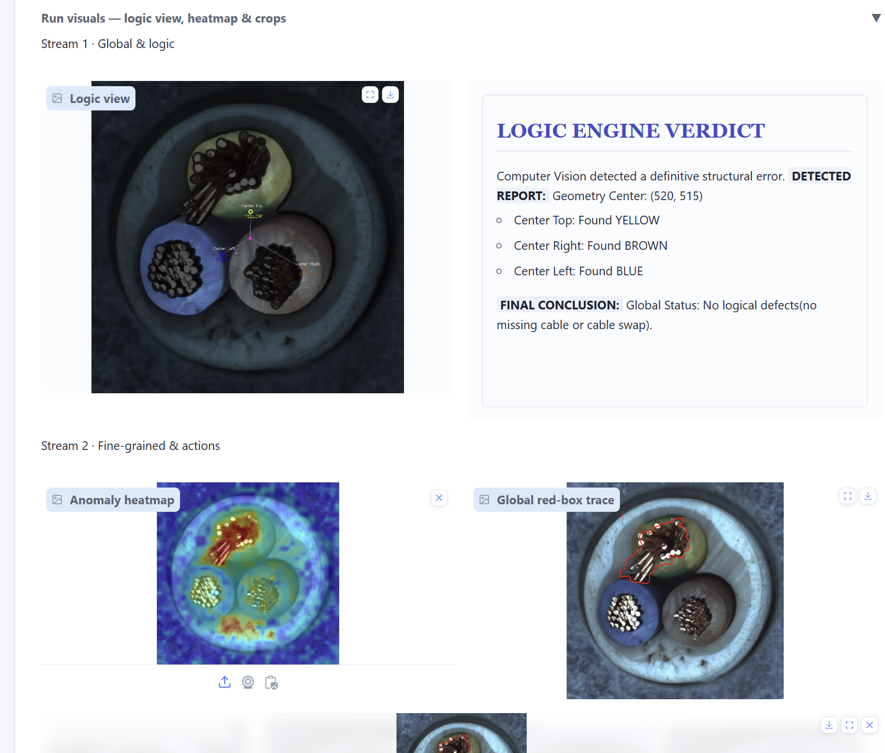
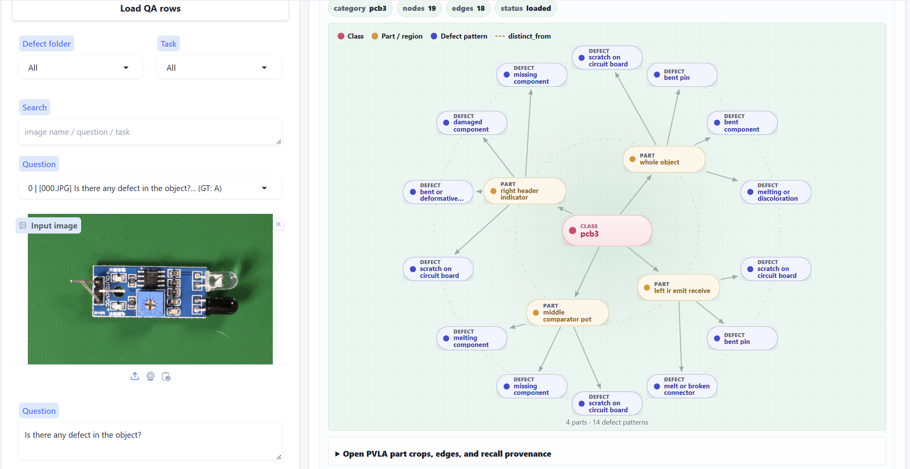
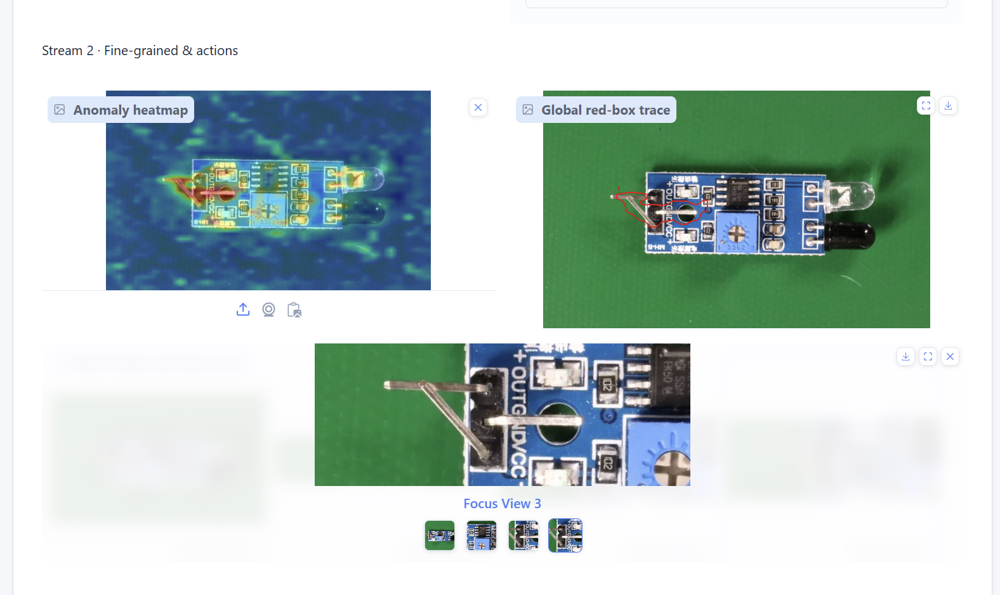

# GLLS

Global Logic and Local Semantic inspection for industrial anomaly question
answering.

GLLS is a method-focused research implementation for MMAD-style industrial
visual QA. It answers each question by combining global image reasoning, local
anomaly evidence, SAM3 structural cutouts, and PVLA/RAG graph knowledge, with
compact traces for inspecting how the final answer was selected.

Main entrypoints:

- 🧪 `glls.cli.run`: batch QA evaluation on DS-MVTec and VisA.
- ⚙️ `glls.cli.binary_ad`: binary anomaly detection on MPDD, DTD-Synthetic, and
  DAGM.
- 🖥️ `glls.cli.visualize`: one Gradio frontend for per-question online
  inspection.

Users only need to configure dataset/model paths and use the curated QA
annotations in `qa_collection/`; do not evaluate with the raw MMAD `QA.json`
files.

## 🎯 Motivation

Industrial visual QA often fails when a model only sees the whole image or only
receives unstructured local crops. GLLS treats each answer as evidence search:
the model first forms a global judgment, then checks local anomaly proposals,
segmentation-backed structural cues, and source-backed normal knowledge.

<p align="center">
  
</p>

The motivation figure summarizes the gap between direct visual QA and a
traceable inspection pipeline on industrial anomaly questions.

## 🧠 Method Overview

GLLS combines four components:

1. **🌐 Global inspection**: a VLM first reasons over the full target image and
   the question/options.
2. **🔍 Local evidence search**: the configured localizer produces anomaly
   heatmaps; MCTS expands and ranks local region proposals instead of passing
   every crop blindly to the VLM.
3. **✂️ SAM3 refinement**: SAM3 is used when the task and category benefit from
   structural/local segmentation. Text and box prompts are selected from
   conservative category profiles in `src/glls/seg/sam3_profiles.py`.
4. **🧩 PVLA/RAG knowledge**: source-backed graph knowledge is retrieved from
   normal references and text knowledge, then passed to the VLM as hierarchical
   visual/text evidence.

<p align="center">
  
</p>

## 🧾 Curated QA Collection

The original MMAD QA annotations are noisy enough to affect evaluation:

- Some questions have the wrong answer label.
- Some questions have multiple valid options.
- Some questions have no valid option.
- Some options are inconsistent with the image or the declared task type.
- DS-MVTec `pill` contains a known contamination problem where QA content was
  mixed with content from another dataset/category; the curated collection uses
  the corresponding corrected MVTec `pill` annotation.

`qa_collection/` fixes annotation issues only. It does not change any MMAD image.
For reproducibility, treat it as a replacement annotation root for the MMAD QA
files. In particular, use `qa_collection/DS-MVTec/pill/QA.json` instead of the
raw MMAD `DS-MVTec/pill/QA.json`; the upstream pill QA file is the known
contamination case. The collection is still a curated research annotation set,
not a claim that every remaining QA row is perfect.

The activation script uses this bundled collection by default. To override it,
set:

```bash
export GLLS_QA_ROOT=/path/to/GLLS/qa_collection
```

Expected layout:

```text
qa_collection/
  DS-MVTec/<category>/QA.json
  VisA/<category>/QA.json
```

## 🚀 Quick Start From Zero

The commands below assume Linux, CUDA, and Python 3.10 or newer. The default
workspace is `~/data/GLLS`; change it once in `scripts/dev/local_paths.sh` if
your datasets or checkpoints live elsewhere.

```bash
git clone https://github.com/KomorebiWerts/GLLS.git
cd GLLS

mkdir -p ~/data/GLLS/envs
python3 -m venv ~/data/GLLS/envs/GLLS
source ~/data/GLLS/envs/GLLS/bin/activate
python -m pip install -U pip

# Install the CUDA build that matches your machine first.
# Example for CUDA 12.8:
python -m pip install torch==2.7.1 torchvision==0.22.1 \
  --index-url https://download.pytorch.org/whl/cu128

python -m pip install -r requirements.txt
```

Create your local path config:

```bash
cp scripts/dev/local_paths.example.sh scripts/dev/local_paths.sh
${EDITOR:-nano} scripts/dev/local_paths.sh
source scripts/dev/activate_glls.sh
```

`activate_glls.sh` loads `scripts/dev/local_paths.sh` automatically and then
sets `PYTHONPATH`, model paths, dataset paths, graph-cache paths, and the Python
environment used by the helper scripts.

Download the localizer artifacts used by the frontend:

```bash
# AdaptCLIP is used for 0-shot frontend runs and as the fallback localizer.
mkdir -p "$GLLS_ADAPTCLIP_ROOT/checkpoints"
# Download the upstream AdaptCLIP MVTec and VisA adapter checkpoints, then place:
#   $GLLS_ADAPTCLIP_ROOT/checkpoints/mvtec_epoch_15.pth
#   $GLLS_ADAPTCLIP_ROOT/checkpoints/visa_epoch_15.pth

# ABounD 1-shot artifact for the published MVTec/VisA frontend path.
hf download komorebi01/glls-abound-1shot \
  --local-dir "$GLLS_ABOUND_SAVE_PATH"
```

The ABounD download should keep this layout:

```text
$GLLS_ABOUND_SAVE_PATH/
  model_config.json
  model/ViT-L-14-336px.pt
  mvtec/final_vvclip_model_state_mvtec.pth
  mvtec/final_soft_prompt_state_mvtec.pth
  mvtec/final_memory_bank_mvtec.pt
  visa/final_vvclip_model_state_visa.pth
  visa/final_soft_prompt_state_visa.pth
  visa/final_memory_bank_visa.pt
```

`scripts/dev/local_paths.example.sh` already points ABounD to the clean artifact
path:

```bash
export GLLS_ABOUND_MODEL_PATH="$GLLS_DATA_ROOT/models/glls-abound-1shot/model"
export GLLS_ABOUND_SAVE_PATH="$GLLS_DATA_ROOT/models/glls-abound-1shot"
```

Check the Hugging Face model card for the artifact license before redistributing
the ABounD files. If no license is declared there, treat the artifact as
research-use until the license is clarified.

## 📁 Repository Layout

```text
GLLS/
  qa_collection/                 # curated MMAD QA annotations
  requirements.txt               # public install entrypoint
  requirements-glls.txt          # pinned GLLS runtime dependencies
  scripts/
    dev/activate_glls.sh         # environment and path setup
    dev/local_paths.example.sh   # copy to local_paths.sh and edit once
    run/run_main.sh              # DS-MVTec/VisA QA wrapper
    run/run_binary_ad.sh         # MPDD/DTD/DAGM wrapper
    run/run_visualize.sh         # Gradio frontend wrapper
    data/                        # binary AD metadata/offline PVLA preparation
  src/glls/
    cli/                         # run, binary_ad, visualize
    data/                        # MMAD QA loaders
    eval/                        # MPDD/DTD/DAGM binary AD pipeline
    models/                      # localizer, MCTS, logic, policies
    rag/                         # PVLA graph/RAG construction and retrieval
    seg/                         # SAM3 engine and prompt profiles
```

## 🧱 Data and Checkpoint Setup

Download MMAD from the upstream project
[`jam-cc/mmad`](https://github.com/jam-cc/mmad) or the Hugging Face mirror
[`jiang-cc/MMAD`](https://huggingface.co/datasets/jiang-cc/MMAD). For the QA
experiments in this repository, place the MMAD image folders used by GLLS under
the path configured by `GLLS_DATASET_ROOT`:

```text
$GLLS_DATASET_ROOT/
  DS-MVTec/<category>/...
  VisA/<category>/...
```

Only these image/data folders are read from the downloaded MMAD tree. The raw
MMAD annotation files are not the evaluation annotations for this repository.
Point `GLLS_QA_ROOT` at the curated QA annotations shipped here:

```text
$GLLS_QA_ROOT/
  DS-MVTec/<category>/QA.json
  VisA/<category>/QA.json
```

The default `scripts/dev/local_paths.example.sh` already sets
`GLLS_QA_ROOT` to this repository's `qa_collection/`. Keep that setting unless
you intentionally maintain a separate curated QA copy. If you do keep a separate
QA root, copy or sync this repository's `qa_collection/DS-MVTec/pill/QA.json`
over any raw MMAD `DS-MVTec/pill/QA.json` file before evaluating `pill`; this is
the known MMAD contamination point where QA content was mixed with content from
another dataset/category.

Quick path check:

```bash
test -d "$GLLS_DATASET_ROOT/DS-MVTec/pill/image"
test -d "$GLLS_DATASET_ROOT/VisA/candle/test/good"
test -f "$GLLS_QA_ROOT/DS-MVTec/pill/QA.json"
test -f "$GLLS_QA_ROOT/VisA/candle/QA.json"
```

For binary anomaly detection, configure these optional paths:

```text
$GLLS_MPDD_ROOT
$GLLS_DTD_ROOT          # DTD-Synthetic, not raw Oxford DTD classification
$GLLS_DAGM_ROOT
```

Recommended model resources:

| Component | Source | Configure as |
| --- | --- | --- |
| VLM | [Qwen/Qwen3-VL-8B-Instruct](https://huggingface.co/Qwen/Qwen3-VL-8B-Instruct) or another compatible Qwen/LLaVA local model | `GLLS_VLM_MODEL_PATH` |
| SAM3 | [facebookresearch/sam3](https://github.com/facebookresearch/sam3) checkpoint links | `GLLS_SAM3_PATH` |
| SAM3 code | [facebookresearch/sam3](https://github.com/facebookresearch/sam3) | `GLLS_DATA_ROOT/external/sam3` on `PYTHONPATH` |
| CLIP backbone | [openai/clip-vit-large-patch14-336](https://huggingface.co/openai/clip-vit-large-patch14-336) or OpenCLIP-compatible ViT-L/14@336px weights | downloaded/cached by localizer |
| AdaptCLIP | [gaobb/AdaptCLIP](https://github.com/gaobb/AdaptCLIP) adapter checkpoints | `GLLS_ADAPTCLIP_ROOT/checkpoints/<domain>_epoch_15.pth` |
| Text embedding | [BAAI/bge-base-en-v1.5](https://huggingface.co/BAAI/bge-base-en-v1.5) | `GLLS_EMBEDDING_MODEL_PATH` |
| ABounD 1-shot | [komorebi01/glls-abound-1shot](https://huggingface.co/komorebi01/glls-abound-1shot), including `model_config.json` | `GLLS_ABOUND_MODEL_PATH` / `GLLS_ABOUND_SAVE_PATH` |

The frontend selects ABounD automatically for MVTec/VisA 1-shot inspection.
MVTec/VisA 0-shot inspection and other frontend dataset/shot combinations use
AdaptCLIP. Batch CLI runs remain explicit: pass `--localizer adaptclip` or
`--localizer abound`.

## 🧩 Build PVLA Graph Knowledge

PVLA graph caches are read from `GLLS_GRAPH_CACHE_ROOT`.

```bash
source scripts/dev/activate_glls.sh
python -m glls.rag.build_graph
```

Run this after your text knowledge and normal-reference assets are placed under
the configured database root. The QA and binary-AD entrypoints will then retrieve
source-backed graph blocks from `GLLS_GRAPH_CACHE_ROOT`.

## 🧪 Run DS-MVTec / VisA QA

Check the available options:

```bash
python -m glls.cli.run --help
bash scripts/run/run_main.sh --help
```

Run one DS-MVTec category:

```bash
source scripts/dev/activate_glls.sh
python -m glls.cli.run \
  --dataset mvtec \
  --subclass bottle \
  --dataset_root "$GLLS_DATASET_ROOT" \
  --qa_root "$GLLS_QA_ROOT" \
  --graph_cache_root "$GLLS_GRAPH_CACHE_ROOT" \
  --model_path "$GLLS_VLM_MODEL_PATH" \
  --sam_path "$GLLS_SAM3_PATH" \
  --localizer adaptclip \
  --k_shot 1 \
  --adaptclip_checkpoint_domain mvtec \
  --output_dir outputs/mvtec_bottle
```

Run one VisA category:

```bash
source scripts/dev/activate_glls.sh
python -m glls.cli.run \
  --dataset visa \
  --subclass candle \
  --dataset_root "$GLLS_DATASET_ROOT" \
  --qa_root "$GLLS_QA_ROOT" \
  --graph_cache_root "$GLLS_GRAPH_CACHE_ROOT" \
  --model_path "$GLLS_VLM_MODEL_PATH" \
  --sam_path "$GLLS_SAM3_PATH" \
  --localizer adaptclip \
  --k_shot 1 \
  --adaptclip_checkpoint_domain visa \
  --output_dir outputs/visa_candle
```

Each result row includes prediction, answer parsing, heatmap evidence, MCTS
action trace, SAM3 refinement audit, PVLA/RAG provenance, and final prompt
evidence.

## 🖥️ Run the Online Frontend

```bash
source scripts/dev/activate_glls.sh
bash scripts/run/run_visualize.sh --host 127.0.0.1 --port 7861
```

Open:

```text
http://127.0.0.1:7861
```

The frontend is designed for method playback rather than raw path debugging:

1. Initialize the runtime from your local path config.
2. Choose dataset, shot count, category, task, and QA row.
3. Run GLLS and inspect the two-stage evidence flow: Phase-1 global report,
   small-model heatmap proposals, MCTS crop search, SAM3 structural cut/gate,
   source-backed PVLA/RAG recall, and Phase-2 answer fusion.

For the published ABounD artifact path, choose `mvtec` or `visa` with `1-shot`
in the frontend. The frontend will load ABounD from `GLLS_ABOUND_MODEL_PATH` and
`GLLS_ABOUND_SAVE_PATH`. Choose `0-shot` for MVTec/VisA to use AdaptCLIP; other
dataset/shot combinations also use AdaptCLIP.

Representative frontend captures:

<p align="center">
  
</p>

<p align="center">
  
</p>

<p align="center">
  
</p>

<p align="center">
  
</p>

<p align="center">
  
</p>

## ⚙️ Run MPDD / DTD / DAGM Binary AD

Prepare dataset metadata and offline normal-reference PVLA/SAM3 assets:

```bash
source scripts/dev/activate_glls.sh
python scripts/data/prepare_binary_ad_datasets.py
python scripts/data/prepare_binary_ad_offline.py --dataset all --max_refs 1 --with_sam3
```

Run the evaluator:

```bash
python -m glls.cli.binary_ad --dataset all --output_dir outputs/binary_ad
```

or:

```bash
bash scripts/run/run_binary_ad.sh
```

The binary AD path keeps the same method structure: localizer heatmap scoring,
MCTS-style region selection, SAM3 region refinement, and PVLA normal-reference
knowledge.
